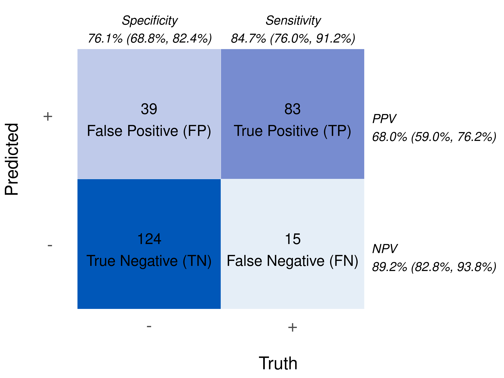

<!-- README.md is generated from README.Rmd. Please edit that file -->

# diagnosticSummary

<!-- badges: start -->

[](https://www.tidyverse.org/lifecycle/#experimental)
[](https://github.com/overdodactyl/diagnosticSummary/actions)
<!-- badges: end -->

`diagnosticSummary` is designed to quickly create diagnostic summaries
and reports for binary classification data.

## Installation

You can install the development version from
[GitHub](https://github.com/) with:

``` r
# install.packages("devtools")
devtools::install_github("overdodactyl/diagnosticSummary")
```

## Example

``` r
library(diagnosticSummary)
# Load sample data
data("dx_heart_failure")
head(dx_heart_failure)
#>   AgeGroup    Sex truth   predicted           AgeSex
#> 1  (20,50]   Male     0 0.016164112   (20,50] - Male
#> 2  (20,50]   Male     0 0.074193671   (20,50] - Male
#> 3  (20,50] Female     0 0.004677979 (20,50] - Female
#> 4  (20,50] Female     0 0.017567313 (20,50] - Female
#> 5  (20,50] Female     0 0.017517025 (20,50] - Female
#> 6  (20,50]   Male     0 0.051570734   (20,50] - Male

# Create dx object
dx_obj <- dx(
  data = dx_heart_failure,
  true_varname = "truth",
  pred_varname = "predicted",
  outcome_label = "Heart Attack",
  threshold_range = c(.1,.2,.3),
  setthreshold = .3,
  grouping_variables = c("AgeGroup", "Sex", "AgeSex")
)
```

``` r
summary(dx_obj, variable = "Overall", show_var = F, show_label = F)
```

| measure                   | estimate             | fraction | CI Type      | notes  |   n |
|:--------------------------|:---------------------|:---------|:-------------|:-------|----:|
| AUC                       | 0.904 (0.864, 0.943) |          | DeLong       |        | 261 |
| Accuracy                  | 79.3% (73.9%, 84.1%) | 207/261  | exact        |        | 261 |
| Sensitivity               | 84.7% (76.0%, 91.2%) | 83/98    | exact        | \>=0.3 | 261 |
| Specificity               | 76.1% (68.8%, 82.4%) | 124/163  | exact        | \<0.3  | 261 |
| Positive Predictive Value | 68.0% (59.0%, 76.2%) | 83/122   | exact        |        | 261 |
| Negative Predictive Value | 89.2% (82.8%, 93.8%) | 124/139  | exact        |        | 261 |
| LRT+                      | 3.54 (2.66, 4.71)    |          | Large sample |        | 261 |
| LRT-                      | 0.20 (0.13, 0.32)    |          | Large sample |        | 261 |
| Odds Ratio                | 17.6 (9.1, 33.9)     |          | Large sample |        | 261 |
| F1 Score                  | 75.5                 |          |              |        | 261 |

Threshold: 0.3

``` r
dx_forest(dx_obj)
```


``` r
dx_roc(dx_obj)
```


``` r
dx_cm(dx_obj)
```


